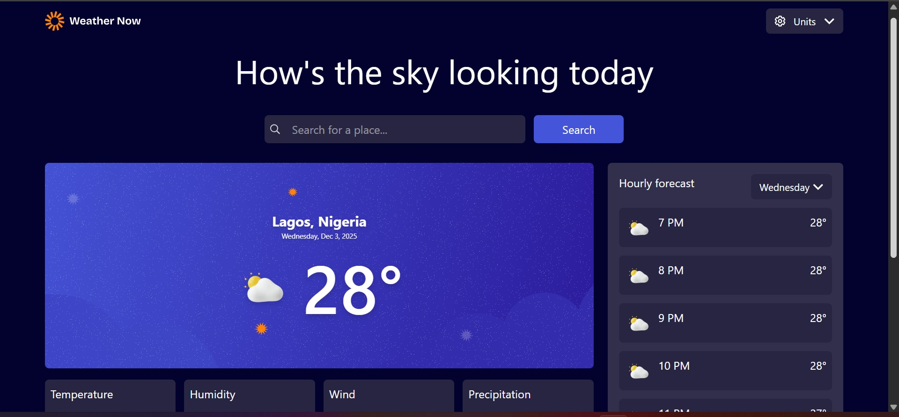
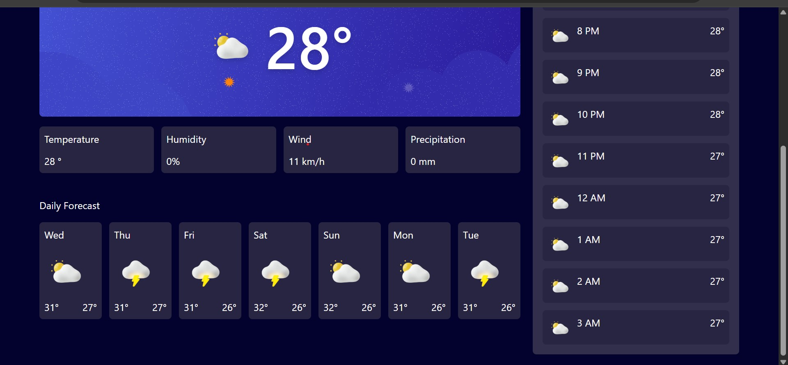

## Table of contents

- [Overview](#overview)
  - [The challenge](#the-challenge)
  - [Screenshot](#screenshot)
  - [Links](#links)
- [My process](#my-process)
  - [Built with](#built-with)
  - [What I learned](#what-i-learned)
  - [Continued development](#continued-development)
- [Author](#author)

## Overview
This weather app uses live api from open-meteo, displays current weather conditions and location details, additionally displays weather forecast for the next seven days alongside hourly forecast for the next seven hours. This application was developed with vite + react with tailwindcss for styling, tanstack query for interacting with the API and context Api for managing global state. 

### The challenge
Users should be able to:

- Search for weather information by entering a location in the search bar
- View current weather conditions including temperature, weather icon, and location details
- See additional weather metrics like "feels like" temperature, humidity percentage, wind speed, and precipitation amounts
- Browse a 7-day weather forecast with daily high/low temperatures and weather icons
- View an hourly forecast showing temperature changes throughout the day
- Switch between different days of the week using the day selector in the hourly forecast section
- Toggle between Imperial and Metric measurement units via the units dropdown 
- Switch between specific temperature units (Celsius and Fahrenheit) and measurement units for wind speed (km/h and mph) and precipitation (millimeters) via the units dropdown
- View the optimal layout for the interface depending on their device's screen size
- See hover and focus states for all interactive elements on the page

### Screenshot





### Links

- [Live Site URL](https://weather-app-plum-eight-36.vercel.app/)

## My process

### Built with

- [React](https://reactjs.org/) - JS library
- [Vite](https://vite.dev/) - Build Tool
- [TailwindCss](https://tailwindcss.com/) - For styles
- [Tanstack Query](https://tanstack.com/query/latest) - Api state management


### What I learned
* Working on this project I learned how to work with tanstack query to fetch data from an api 

* I also learnt how to use the tailwind animations utilities to display loading states for better ux. A snippet from the code can be found below, here we are using **animate-pulse** other utilities that can be used for different functions includes; **animate-bounce**, **animate-ping** and **animate-spin**. 
```html
<section className='p-4 bg-neutral-700 w-full lg:w-[30%] rounded-md h-full animate-pulse'>
    <div className='flex justify-between gap-2 text-neutral-0 mb-3 rounded-md'>
        <div className="h-6 w-32 bg-neutral-600 rounded">-</div>
        <div className="h-8 w-24 bg-neutral-600 rounded"></div>
    </div>
    <div className='flex flex-col gap-3'>
        {/* Render 5 skeleton cards */}
        {[1, 2, 3, 4, 5].map((i) => (
            <div key={i} className="h-16 w-full bg-neutral-600 rounded-md"></div>
        ))}
    </div>
</section>
```

* I used the function below to get specific weather icons for specific weather details, i abstracted the entire functionality and i used the array.include method to return the weather icons for each code provided by the weather api
```Js
export const getWeatherIcon = (code) => {
    if (code === 0) return iconSunny;

    if ([1,2,3].includes(code)) return iconPartlyCloudy;
    if ([45,48].includes(code)) return iconFog;
    if ([51,53,55].includes(code)) return iconDrizzle;
    if ([61,63,65,66,67].includes(code)) return iconRain;   
    if ([71, 73, 75, 77].includes(code)) return iconSnow;
    if (code === 95) return iconStorm;

    return iconPartlyCloudy;
}
```

* I used the useRef hook in the hero section when a user is searching for a specific location to abstract the entire details of the location(latitude & longitude) to provide for the api and only display the city for the user to select.


### Continued development

Moving forward, I would love to learn how to use tanstack query and fetch more comfortably. 

## Author

- Website - [Oludare Abdulazeez Ajadi](https://ajadii.vercel.app/)
- Twitter - [@ajadii_](https://x.com/ajadii_)


